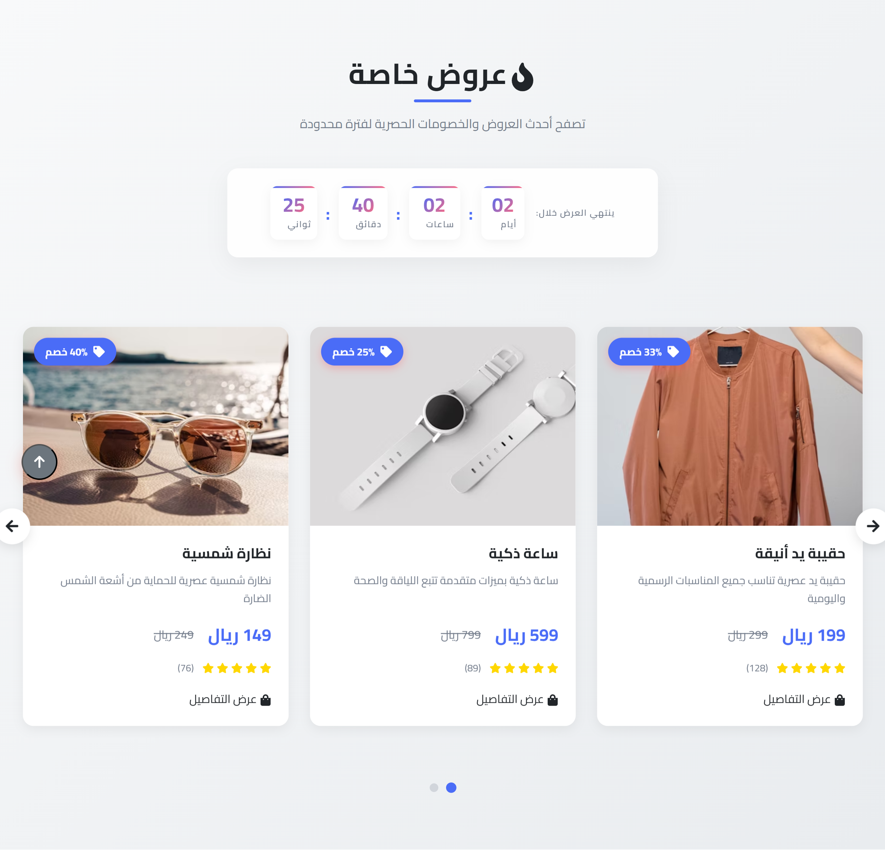
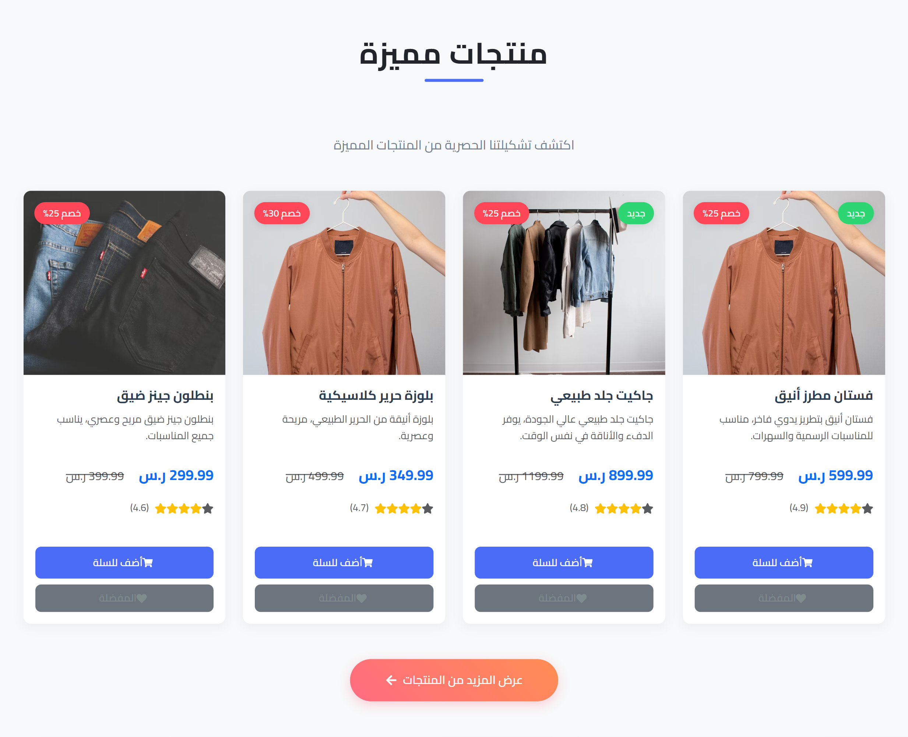
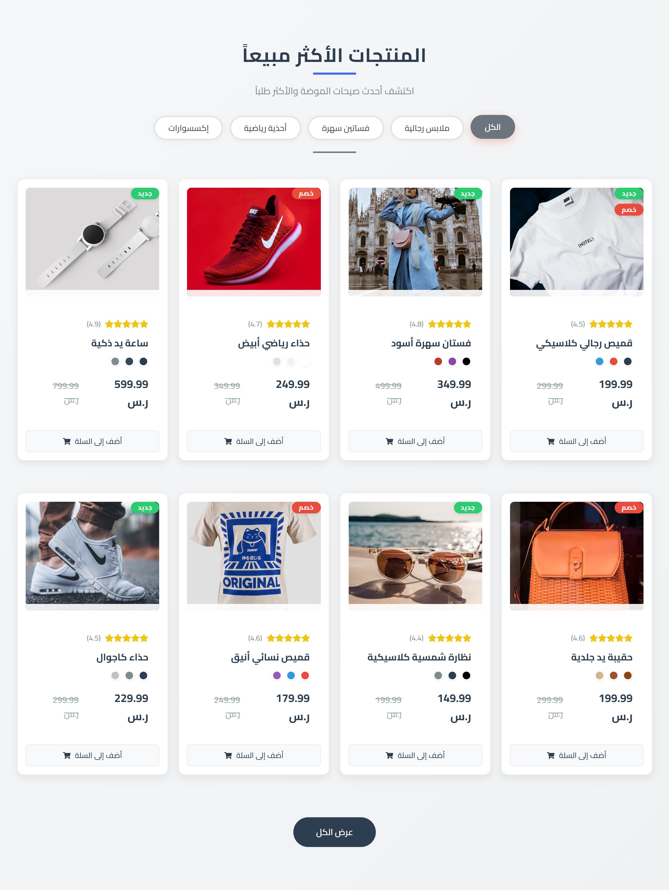
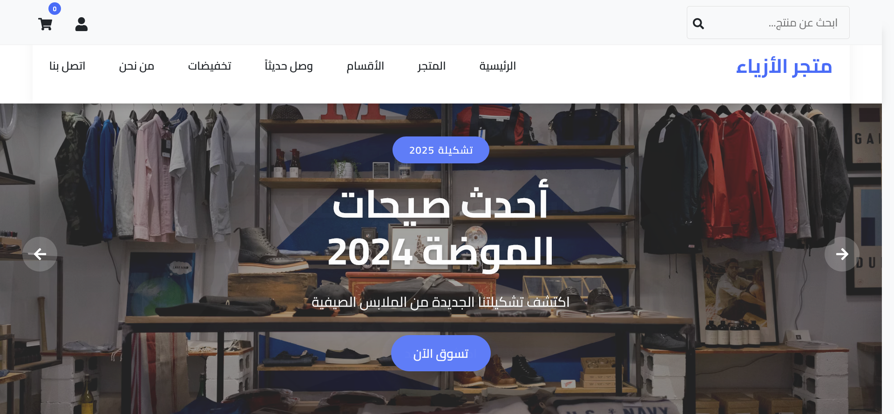

# FashionShop - Modern E-commerce Frontend

[](https://reactjs.org/)
[](https://vitejs.dev/)
[](https://getbootstrap.com/)
[](https://github.com/yourusername/fashion-shop)
[](LICENSE)

<div style="display: grid; grid-template-columns: repeat(auto-fit, minmax(300px, 1fr)); gap: 20px; margin: 20px 0;">
  
  
  
  
</div>

A responsive, modern e-commerce frontend built with React.js, Vite, and Bootstrap 5, featuring a clean UI with RTL support for Arabic language.

## 🌟 Features

### 🛍️ Product Features
- **Responsive Product Grid**: Adapts to all screen sizes
- **Product Filtering**: By category, price range, and search
- **Product Sorting**: By price, popularity, and newest
- **Product Details**: Detailed view with image gallery
- **Product Badges**: New arrivals and sale items

### 🛒 Shopping Features
- **Shopping Cart**: Add/remove items
- **Wishlist**: Save favorite products
- **Quick View**: Quick product preview

### 🎨 UI/UX
- **Fully Responsive**: Mobile-first design
- **RTL Support**: Full Arabic language support
- **Animations**: Smooth transitions and hover effects
- **Dark/Light Mode**: Toggleable theme (coming soon)

## 🛠️ Tech Stack

### Core
- **React 18** - JavaScript library for building user interfaces
- **Vite** - Next Generation Frontend Tooling
- **React Router DOM** - For client-side routing
- **React Icons** - Popular icons for React apps

### Styling
- **Bootstrap 5** - Popular CSS framework
- **Custom CSS** - For custom styling and animations
- **CSS Variables** - For theming and easy customization

### Development Tools
- **ESLint** - For code quality
- **Prettier** - For code formatting
- **Git** - Version control

## 🚀 Getting Started

### Prerequisites
- Node.js (v14 or later)
- npm or yarn

### Installation

1. **Clone the repository**
   ```bash
   git clone [your-repo-url]
   cd fashion-shop
   ```

2. **Install dependencies**
   ```bash
   npm install
   # or
   yarn
   ```

3. **Start the development server**
   ```bash
   npm run dev
   # or
   yarn dev
   ```

4. **Open in browser**
   ```
   http://localhost:5173
   ```

## 📁 Project Structure

```
src/
├── assets/           # Static assets (images, fonts)
├── components/       # Reusable UI components
│   ├── common/      # Common components (Header, Footer, etc.)
│   └── ui/          # Basic UI components (Button, Card, etc.)
├── pages/           # Page components
│   ├── About/       # About page
│   ├── Cart/        # Shopping cart
│   ├── Checkout/    # Checkout process
│   ├── Contact/     # Contact page
│   ├── Products/    # Product listing
│   └── ...
├── App.jsx          # Main App component
└── main.jsx         # Application entry point
```

## 🎨 Styling Guidelines

### CSS Architecture
- **Bootstrap 5** for layout and components
- **Custom CSS** for specific styling needs
- **CSS Variables** for theming
- **RTL Support** for Arabic language

### Naming Conventions
- **BEM** (Block Element Modifier) methodology
- **Component-scoped** styles
- **Meaningful** class names

## Development Progress

### Completed Components
- **UI Components**
  - Navbar: Responsive navigation with cart and user menu
  - Hero: Main banner section with call-to-action
  - Featured Products: Highlighted products section
  - Popular Items: Grid of popular products with filtering
  - Testimonials: Customer reviews section
  - Special Offers: Promotional banners and discount sections
  - Footer: Site navigation and contact information

### Completed Pages
- **Home Page**: Landing page with all main components
- **About Page**: Company information and team section
- **Contact Page**: Contact form and information with Google Maps integration

### Pages Under Development
The following pages are currently in development:
- **Product Catalog**: Complete product listing with filters
- **Product Details**: Detailed product view with gallery
- **Shopping Cart**: Cart management and checkout process
- **User Authentication**: Login and registration system
- **Checkout Process**: Order completion flow
- **Special Sections**: Sales and new arrivals pages

## Deployment

### Build for Production
```bash
npm run build
# or
yarn build
```

### Preview Production Build
```bash
npm run preview
# or
yarn preview
```

## 📝 License

This project is licensed under the MIT License - see the [LICENSE](LICENSE) file for details.

## 🙏 Acknowledgments

- [React](https://reactjs.org/)
- [Vite](https://vitejs.dev/)
- [Bootstrap](https://getbootstrap.com/)
- [React Icons](https://react-icons.github.io/react-icons/)

---

<div align="center">
  Developed with ❤️ by Mohamed Fadl
</div>
